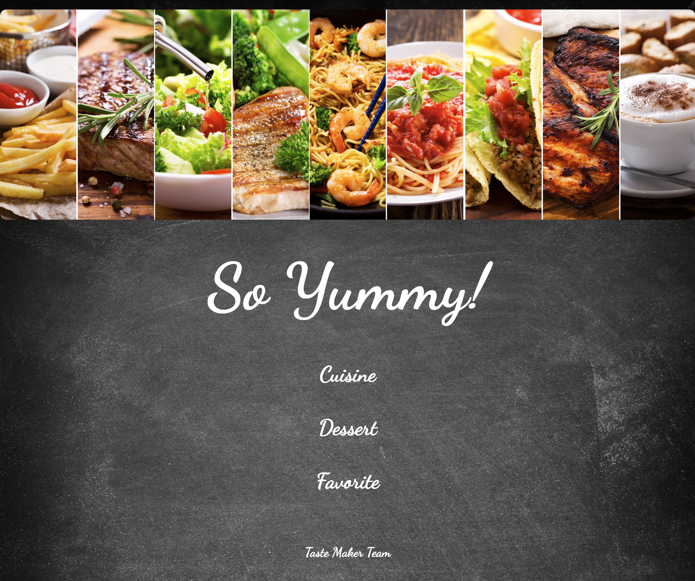
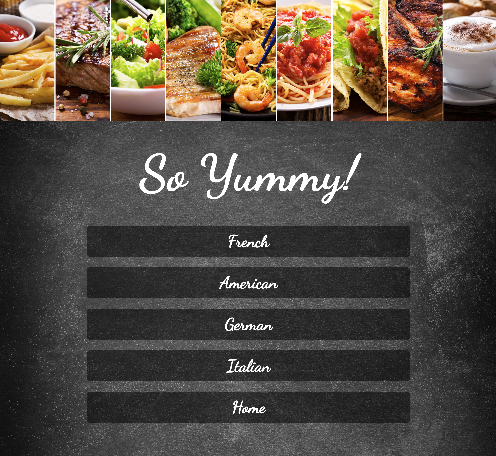
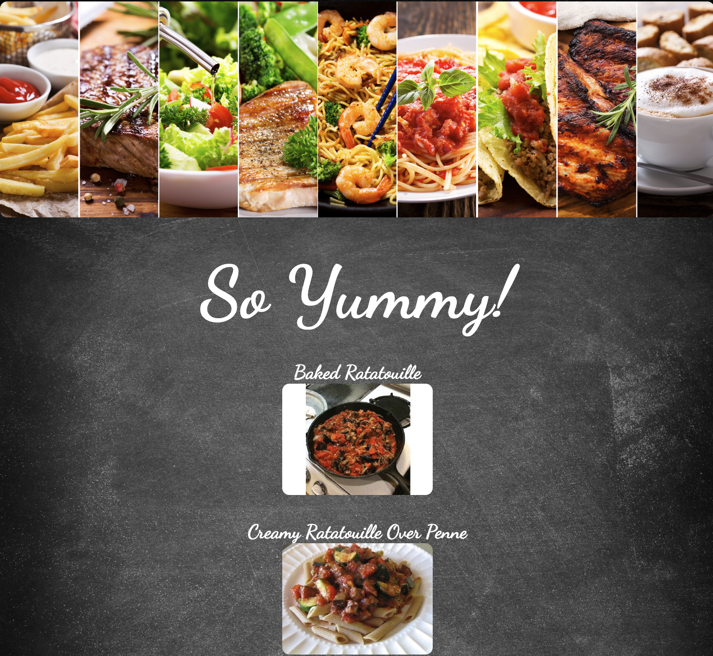
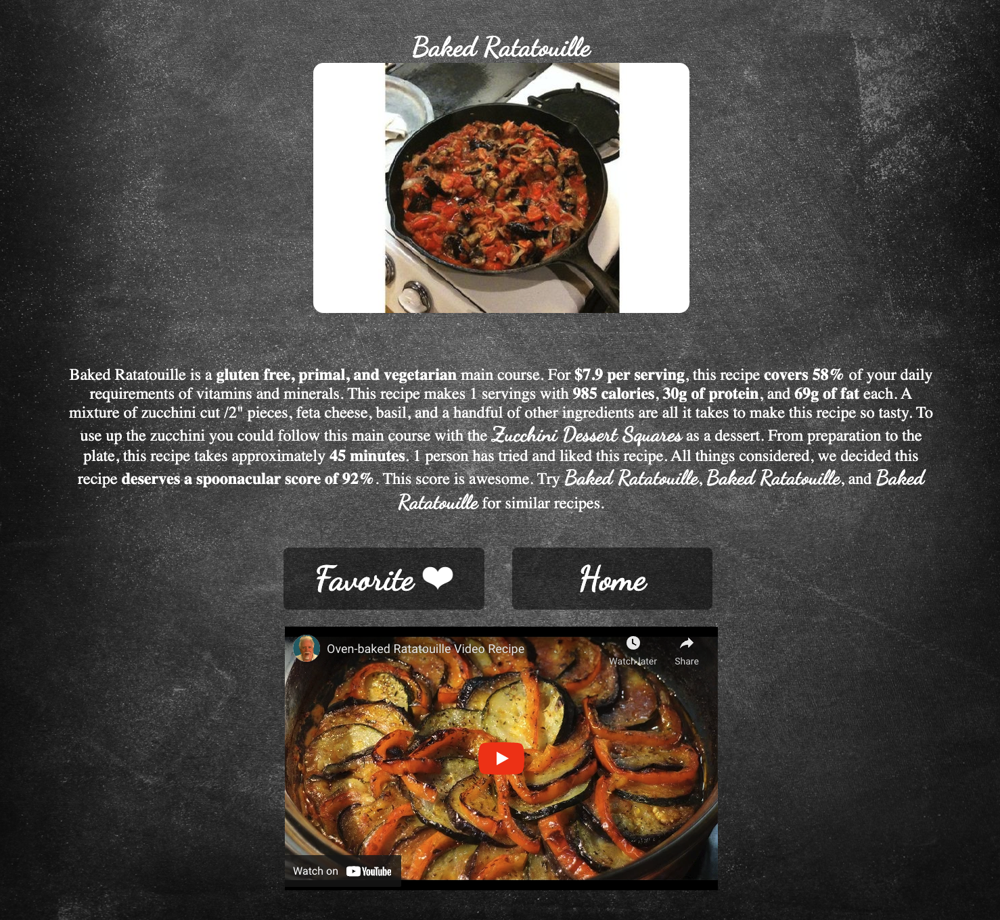
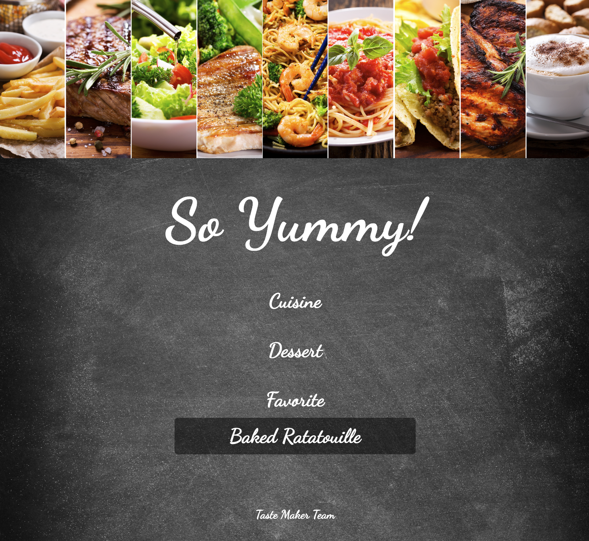
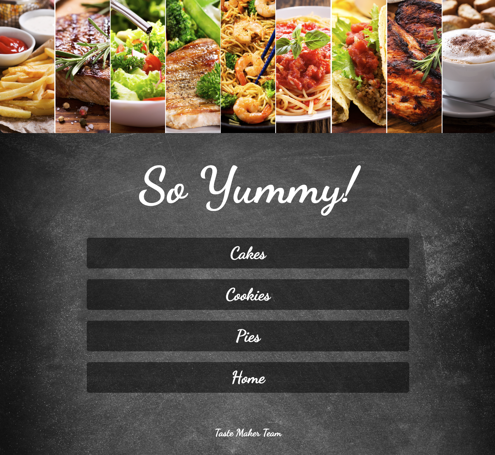
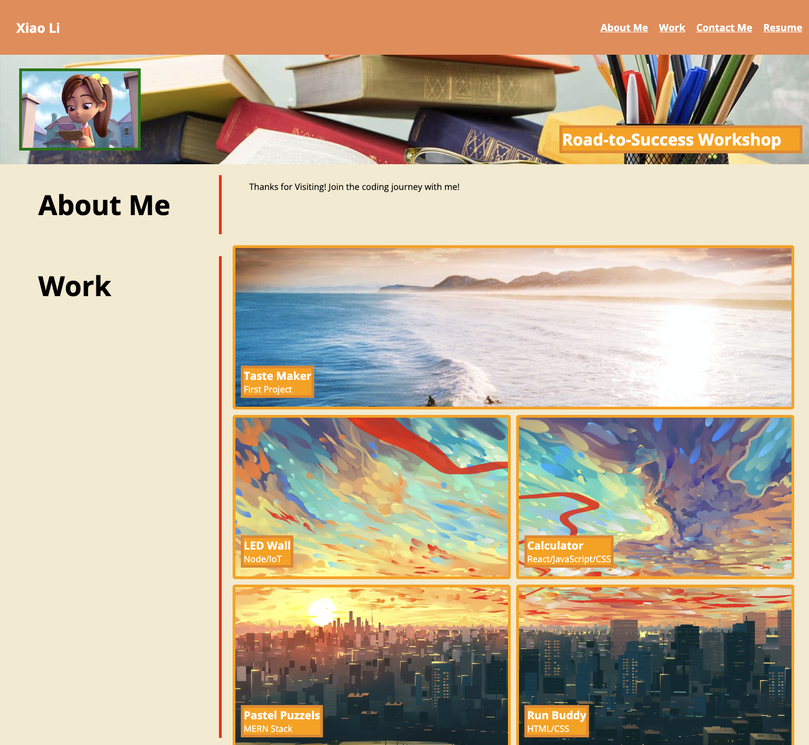

# taste_makers
Recipe finder app with UTAustin Bootcamp 

## User Stories
 would like to choose between protein  and cooking style options, and based on these options be given a video recipe. The User can also save a list of favorite recipes to reference at a later date. The User will have a seamless experience getting data from the Spoonacular and YouTube APIs.

## Live Application
https://shelldan.github.io/taste-makers/

## Acceptance Criteria
1 When homepage loads User have a choice of 4 protein options
2 When homepage loads User has a choice of style of cuisine
3 When homepage loads User has a choice of desert options
4 When 'Go/Make Recipe' button is clicked User is presented with recipe multiple options.

## API
* Spoonacular: https://spoonacular.com/food-api
* Youtube: https://developers.google.com/youtube/v3

## Screenshot of website

* When user clicks cuisine, the user will be presented with four cuisine styles: French, American, German, and Italian 

* When user clicks one of the styles, the user will be presented with 10 different recipes

* When user clicks one of the recipes, the user will be presented with a descriptive recipe information and a youtube video to go along with it 

* When user clicks the favorite button, the recipe will be saved to homepage; When user clicks home button, it will always take you back to the homepage! 

* Similarly, when user clicks the dessert button, it will have the similar layout as cuisine!
 

## Portfolio 
* The first project is added to my portfolio, by clicking 'Taste Maker' you will be redirect the my first project! 

## Live Portfolio
https://shelldan.github.io/portfolio/

